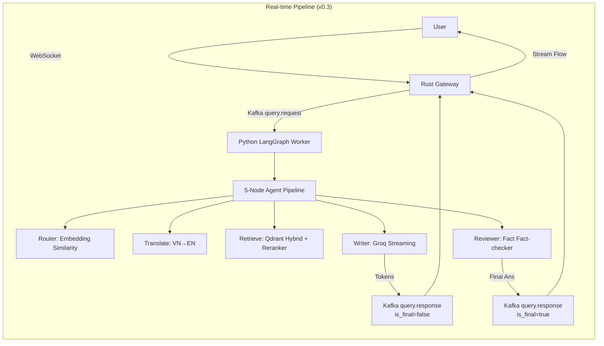

# 🧠 Event-Driven ArXiv RAG — Trợ lý Nghiên cứu AI

Hệ thống trả lời câu hỏi AI/ML bằng tiếng Việt, dựa trên papers ArXiv.  
Phiên bản mới nhất **v0.3** đã được refactor hoàn toàn sang kiến trúc **LlamaIndex + LangGraph + Groq Streaming** kết hợp **Kafka** để mang lại trải nghiệm phản hồi siêu tốc và hoạt động độc lập trên cấu hình máy local (P1000 GPU).

```
Vietnamese Query → [WebSocket] → [Kafka] → [LangGraph Pipeline] → Streaming Vietnamese Answer
```

## 🏗️ Architecture (v0.3)

Hệ thống sử dụng **Redpanda (Kafka)** làm xương sống để kết nối giữa máy chủ **Rust** (Front-facing) và các worker **Python** (Backend processing). Toàn bộ xử lý AI (LLM) đã được chuyển về Python, Rust chỉ đóng vai trò phân phối WebSockets với độ trễ cực thấp.



### Điểm nổi bật ở v0.3
1. **LlamaIndex Indexer (Tốc độ & Ổn định):** 
   - KHÔNG dùng LLM cho entity extraction nữa (tránh timeouts trên thẻ GPU yếu).
   - Chỉ sử dụng mô hình embedding (BAAI/bge-m3) để tạo local/dense & sparse vectors.
   - Kết quả: Giảm thời gian index từ >10 giờ xuống còn **2-3 phút** cho một mẻ 30 papers.
2. **LangGraph Pipeline:** Flow thông minh qua 5 bước: Classifier (0-LLM, dùng Embedding) → Translation → Hybrid Search + Cross-Encoder Reranking → Generator → Fact-checker.
3. **Groq Realtime Streaming:** Sử dụng Server-Sent Events (SSE) đẩy token trực tiếp qua Kafka channel về Rust WebSockets → Trải nghiệm typing animation như ChatGPT với thời gian chờ cho First Token dưới **1 giây**.

## 🧩 Tech Stack

| Component | Technology |
|-----------|-----------|
| **API Gateway / WebSocket** | Rust (Actix-Web, actix-ws) |
| **Message Broker** | Redpanda (Kafka-compatible) |
| **Indexing / Retrieval** | LlamaIndex (Qdrant Vector Store) |
| **Agent Orchestration** | LangGraph + LangChain Core |
| **Vector DB** | Qdrant (Dense + Sparse Hybrid Search) |
| **Cloud LLM (Generation)** | Groq API (LLaMA-3.3-70b / LLaMA-3.1-8b) |
| **Local Models** | BAAI/bge-m3 (Embeddings), BGE-Reranker-v2 (Cross-Encoder) |

## 🚀 Quick Start (Chạy Hệ Thống)

### 1. Chuẩn bị Hạ Tầng
```bash
# 1. Bật Docker (Qdrant & Redpanda)
docker-compose up -d

# 2. Cài đặt Python requirements (Yêu cầu Python 3.10+)
cd python && pip install -r requirements.txt

# 3. Khởi tạo Kafka Topics & Qdrant Collections
python python/kafka_workers/kafka_config.py
```

### 2. Khởi động Kafka Workers (Mở 3 Terminal Python)
```bash
# Terminal 1: Ingestion Worker (Tải & Băm nhỏ Paper thành đoạn)
python python/kafka_workers/ingestion_worker.py

# Terminal 2: LlamaIndex Indexer (Embed & Đẩy Vector vào Qdrant - siêu nhanh, không cần LLM)
python python/kafka_workers/indexer_worker.py

# Terminal 3: Query Processor (Chạy LangGraph pipeline & Phát streaming tokens)
python python/kafka_workers/query_worker.py
```

### 3. Khởi động Rust Web Server
```bash
# Terminal 4: Server Gateway duy trì WebSocket & Phân phối Token
cd rust_backend
cargo run --release
```

### 4. Đẩy Dữ Liệu Thực Tế (Trigger)
```bash
# Terminal 5: Tải các papers mới nhất thuộc nhóm cs.AI và đẩy vào hệ thống Kafka
python python/scripts/01_download_data.py
```

### 5. Trải nghiệm
Mở trình duyệt truy cập: `http://localhost:8080`

## 📁 Project Structure

```
├── python/
│   ├── agents/             # Trái tim logic (LangGraph, State, Router, Translator, Writer, Reviewer)
│   ├── indexing/           # LlamaIndex (LlamaIndexer, Hybrid Search v2)
│   ├── data_processing/    # Công cụ chia nhỏ ArXiv Documents
│   ├── retrieval/          # Hybrid search logic và Cross-encoder
│   └── kafka_workers/      # Các Consumer/Producer kết nối Kafka
├── rust_backend/
│   ├── src/services/       # Cầu nối (Kafka, Qdrant)
│   └── src/routes/         # Endpoint duy nhất: ws.rs (WebSocket Handler)
├── frontend/               # Chat UI HTML/CSS/JS (Hỗ trợ Live Cursor Animation & Streaming Token)
├── docker-compose.yml      # Redpanda Kafka Broker + Redpanda Console + Qdrant Vector DB
└── qdrant_storage/         # Thư mục chứa cơ sở dữ liệu Vector (Persistence)
```
