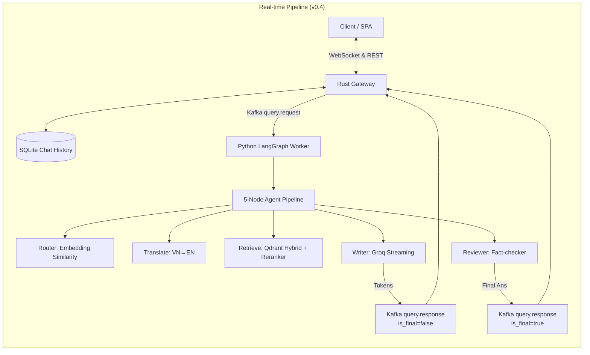

# 🧠 Event-Driven ArXiv RAG

Hệ thống trả lời câu hỏi AI/ML bằng tiếng Việt, dựa trên papers ArXiv.  
Phiên bản mới nhất **v0.4** đã được lột xác hoàn toàn cả về kiến trúc xử lý (LlamaIndex + LangGraph + Groq Streaming kết hợp Kafka) lẫn giao diện người dùng (Ethereal SPA Tailwind) và hệ thống lưu trữ lịch sử trò chuyện (SQLite). Hệ thống mang lại trải nghiệm tương tác mượt mà, phản hồi siêu tốc và khả năng hoạt động ổn định trên cấu hình máy local (Quadro P1000 GPU 4GB VRAM).

```
Vietnamese Query → [WebSocket] → [Kafka] → [LangGraph Pipeline] → Streaming Vietnamese Answer
                      ⇅
               [SQLite Database]
```

## 🏗️ Architecture (v0.4)

Hệ thống sử dụng mô hình vi dịch vụ phân tán (Microservices):

1. **API Gateway (Rust):** Quản lý kết nối WebSocket, lưu trữ lịch sử chat (`Rusqlite`), và giám sát I/O.
2. **Message Broker (Redpanda/Kafka):** Xương sống trung chuyển dữ liệu đa luồng, tách biệt I/O và xử lý AI.
3. **AI Pipeline (Python):** Xử lý toàn bộ logic RAG, LangGraph Agent, và giao tiếp với Groq.



### Điểm nổi bật ở v0.4

1. **Trải nghiệm Ethereal SPA:** Giao diện một trang (Single Page Application) sử dụng Tailwind CSS với Dark Mode, Glassmorphism, thanh Sidebar quản lý lịch sử (tạo/xóa/xem lại session) và Bento Grid hiển thị gợi ý.
2. **Khôi phục Lịch sử Chat:** Backend Rust tích hợp SQLite hỗ trợ lưu trữ toàn bộ phiên chat, tái sử dụng UUID cho các luồng chat liên tục, giúp theo dõi các dự án nghiên cứu dài hạn.
3. **Tối ưu VRAM Tuyệt Đối (P1000 4GB):** Sử dụng Singleton Pattern (`model_registry.py`) cho **BAAI/bge-m3** (Embedding ~1.4GB) và **BGE-Reranker-v2** (Cross-Encoder ~1.2GB), giữ mức tiêu thụ trần luôn ≤2.6GB, không bao giờ tràn RAM. Trọng tải LLM (70B) được offload hoàn toàn cho Groq.
4. **Luồng LangGraph RAG đỉnh cao:** Xử lý qua 5 Node (Phân loại bằng Vector, Dịch, Truy xuất lai & Xếp hạng lại, Viết streaming, và Kiểm duyệt). Tốc độ tạo token <1s per first token (TTFT).

## 🧩 Tech Stack

| Component | Technology |
|-----------|-----------|
| **Frontend UI** | HTML5, Vanilla JS, Tailwind CSS, Material Icons |
| **API Gateway / WebSocket** | Rust (Actix-Web, actix-ws) |
| **Database (History)** | SQLite (rusqlite) |
| **Message Broker** | Redpanda (Kafka-compatible) |
| **Indexing / Retrieval** | LlamaIndex (Qdrant Vector Store) |
| **Agent Orchestration** | LangGraph + LangChain Core |
| **Vector DB** | Qdrant (Dense + Sparse Hybrid Search) |
| **Cloud LLM (Generation)** | Groq API (LLaMA-3.3-70b / LLaMA-3.1-8b) |
| **Local Models** | BAAI/bge-m3 (Embeddings), BGE-Reranker-v2-m3 (Cross-Encoder) |

## 🚀 Quick Start (Chạy Hệ Thống)

### 1. Chuẩn bị Hạ Tầng

```bash
# 1. Bật Docker (Qdrant & Redpanda)
docker-compose up -d

# 2. Cài đặt Python requirements (Yêu cầu Python 3.10+)
cd python && pip install -r requirements.txt

# 3. Khởi tạo Kafka Topics
python python/kafka_workers/kafka_config.py
```

### 2. Khởi động Kafka Workers (Mở 3 Terminal Python)

```bash
# Terminal 1: Ingestion Worker (Tải & Băm nhỏ Paper thành đoạn)
python python/kafka_workers/ingestion_worker.py

# Terminal 2: LlamaIndex Indexer (Embed & Đẩy Vector vào Qdrant)
python python/kafka_workers/indexer_worker.py

# Terminal 3: Query Processor (Chạy LangGraph pipeline & Phát streaming tokens)
python python/kafka_workers/query_worker.py
```

### 3. Khởi động Rust Web Server

```bash
# Terminal 4: Server Gateway duy trì Database, WebSocket & REST API
cd rust_backend
cargo run --release
```

### 4. Đẩy Dữ Liệu Thực Tế (Trigger)

```bash
# Terminal 5: Tải các papers mới nhất thuộc nhóm cs.AI và đẩy vào hệ thống Kafka
python python/scripts/01_download_data.py
```

### 5. Trải nghiệm

Mở trình duyệt truy cập: `http://localhost:8083` (Mọi UI, JS, CSS sẽ tự động được phục vụ trực tiếp từ Rust server).

## 📁 Project Structure

```
├── python/
│   ├── agents/             # Logic AI: LangGraph, Router (0-LLM), Writer, Reviewer, Model Registry
│   ├── indexing/           # Quản trị LlamaIndex, phân mảnh và nhúng Vector
│   ├── data_processing/    # Công cụ tải và bóc tách PDF (loader, cleaner, chunker)
│   ├── retrieval/          # Logic gọi lại Qdrant (Hybrid Dense/Sparse) và Cross-Encoder
│   └── kafka_workers/      # Các background consumer/producer nối với Kafka
├── rust_backend/
│   ├── src/routes/         # API Layer: ws.rs (WebSocket), history.rs (REST API Chat Logs)
│   ├── src/services/       # Cầu nối dữ liệu: kafka.rs, database.rs (SQLite)
│   └── Cargo.toml
├── frontend/               # Single Page App UI: index.html, app.js, style.css
├── docker-compose.yml      # Redpanda Kafka Broker + Qdrant Vector DB
├── qdrant_storage/         # Dữ liệu cục bộ của Vector DB (Auto-generated)
└── chat_history.db         # Database lưu lịch sử cuộc trò chuyện (Auto-generated)
```
